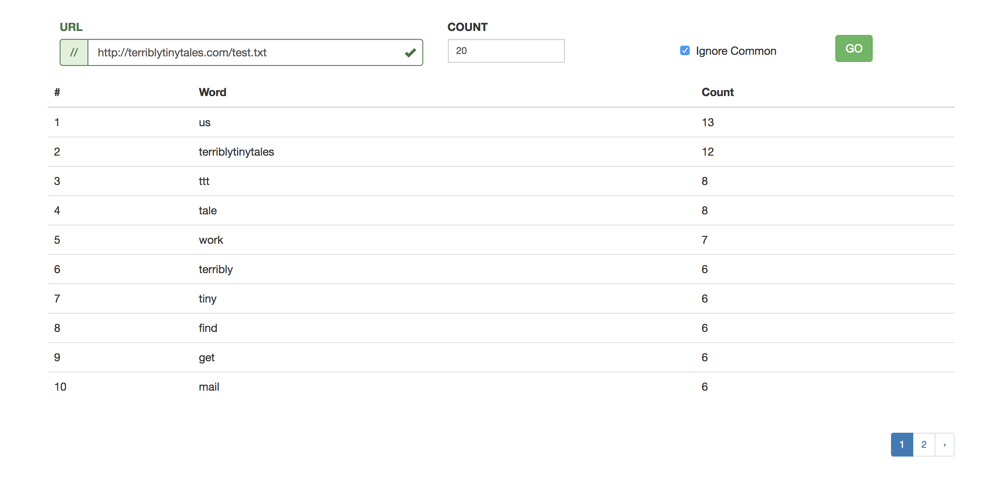
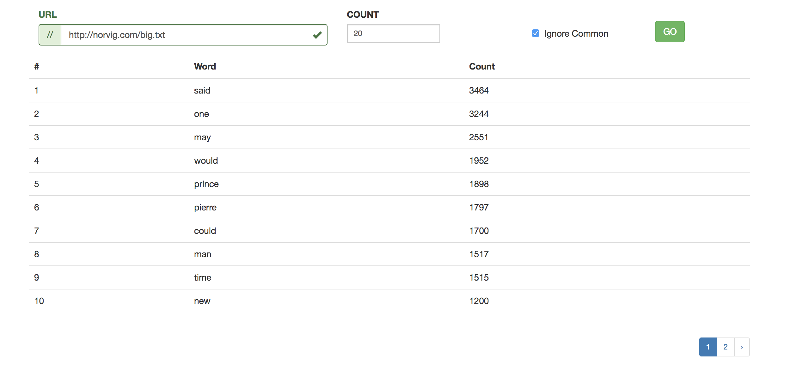
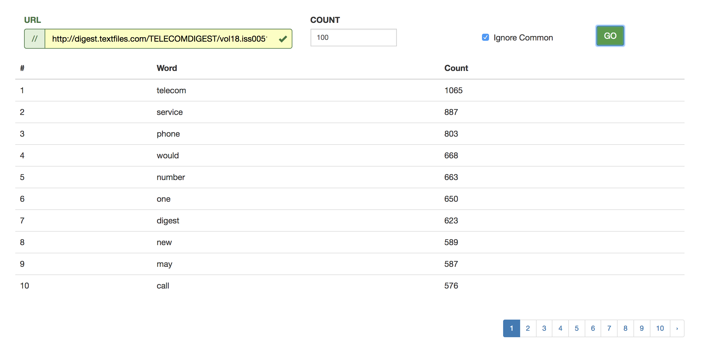
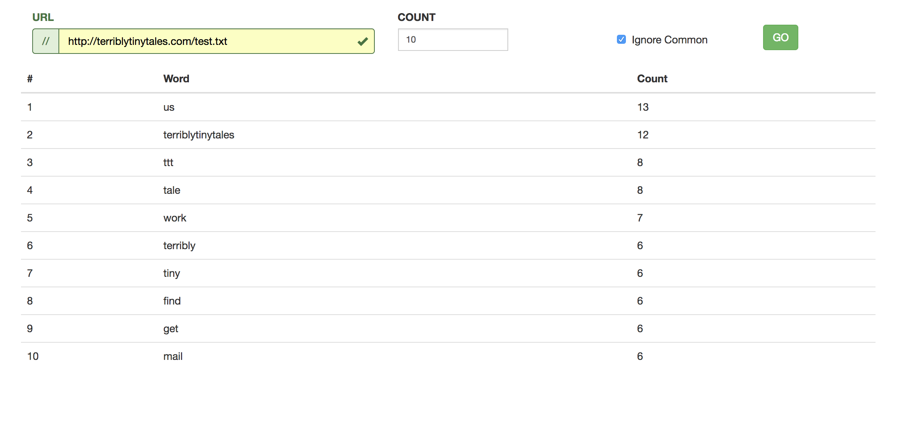

# TTT

> Given a URL and a number N this web application gets its content returns the Top N words.



## Requirements

- Redis ( >= 4.0.8 )
- Node ( >= 9.5.0 )
- Git ( >= 2.13.6 )

## Installation

- Clone the project

- Install required packages

```sh
npm install
sudo npm install -g webpack-cli
```

- Copy default env file and edit as needed

```sh
cp .env.example .env
```

- Bundle client code

```sh
cd client
webpack-cli
```

- Start the server

```sh
npm start
```

## Libraries

### Back end

- **Express**: Quick routing.
- **Body Parser**: Getting the request body as json and sending back json.
- **Dot env**: Parsing env files and putting into nodes environment.
- **Redis**: To cache the url contents for an hour.

### Front end

- **Webpack**: To bundle client side code and compile to es5.
- **Jquery**: To make requests to the back end.
- **React**: To manage the client view.
- **React Router**: To manage client side routing.

## Components

### Back-end Services

- **HTTP Service**: This service first checks the cache for the urls contents. If found returns from there otherwise it actually gets the content and saves it to redis with a time out of 1 hour and finally returns it.

- **Frequency Service**: This service uses a regex to first extract only words(makes all of them lowercase) from the url body. It then depending on the options chosen removes words in the stop word list. It finally calculates the frequency of each word.

- **Top Service**: This service first buckets the words by their frequency and also calculates the maximum frequency. It then depending on the input starts from max and returns the top words.

## Examples

- Test 1:
  - **URL**: [http://norvig.com/big.txt](http://norvig.com/big.txt)
  - **N**: 20
  - 

- Test 2:
  - **URL**: [http://digest.textfiles.com/TELECOMDIGEST/vol18.iss0051-0100.txt](http://digest.textfiles.com/TELECOMDIGEST/vol18.iss0051-0100.txt)
  - **N**: 100
  - 

- Test 3:
  - **URL**: [http://terriblytinytales.com/test.txt](http://terriblytinytales.com/test.txt)
  - **N**: 10
  - 